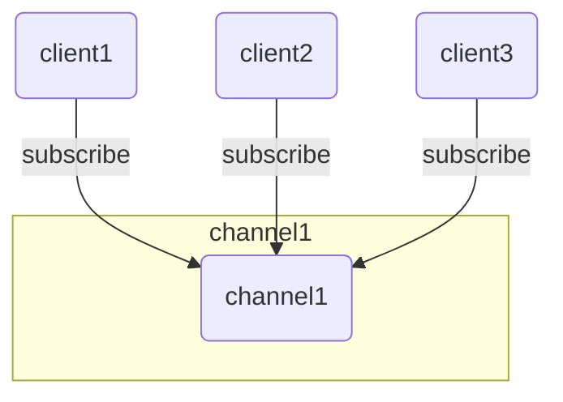
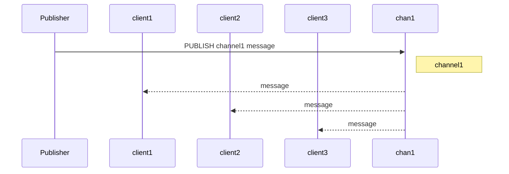

# [0015. Redis 发布订阅](https://github.com/Tdahuyou/TNotes.redis/tree/main/notes/0015.%20Redis%20%E5%8F%91%E5%B8%83%E8%AE%A2%E9%98%85)

<!-- region:toc -->

- [1. 📝 概述](#1--概述)
- [2. 📒 Redis 发布订阅](#2--redis-发布订阅)
- [3. 📒 Redis 发布订阅常用命令](#3--redis-发布订阅常用命令)
- [4. 💻 订阅发布](#4--订阅发布)
- [5. 💻 demos.1 - nodejs 订阅和发布](#5--demos1---nodejs-订阅和发布)

<!-- endregion:toc -->

## 1. 📝 概述

- 了解 redis 中的订阅和发布。

## 2. 📒 Redis 发布订阅

- Redis 发布订阅 (pub/sub) 是一种消息通信模式：发送者 (pub) 发送消息，订阅者 (sub) 接收消息。
- Redis 客户端可以订阅任意数量的频道。
- 下图展示了频道 channel1，以及订阅这个频道的三个客户端 —— client1、client2 和 client3 之间的关系：



- 当有新消息通过 PUBLISH 命令发送给频道 channel1 时， 这个消息就会被发送给订阅它的三个客户端：



## 3. 📒 Redis 发布订阅常用命令

```bash
# 订阅一个或多个符合给定模式的频道。
PSUBSCRIBE pattern [pattern ...]

# 查看订阅与发布系统状态。
PUBSUB subcommand [argument [argument ...]]

# 将信息发送到指定的频道。
PUBLISH channel message

# 退订所有给定模式的频道。
PUNSUBSCRIBE [pattern [pattern ...]]

# 订阅给定的一个或多个频道的信息。
SUBSCRIBE channel [channel ...]

# 指退订给定的频道。
UNSUBSCRIBE [channel [channel ...]]
```

## 4. 💻 订阅发布

::: code-group

```bash [subscriber client1]
# 订阅者 1
SUBSCRIBE myChannel
```

```bash [subscriber client2]
# 订阅者 2
SUBSCRIBE myChannel
```

```bash [subscriber client3]
# 订阅者 3
SUBSCRIBE myChannel
```

```bash [publisher]
# 发布者往 myChannel 发送消息
PUBLISH myChannel "redis publish test"
# (integer) 3
# 这里的 3 表示有 3 个订阅者收到消息

PUBLISH myChannel "Learn redis by TNotes.redis notes"
# (integer) 3
```

:::

- 在发布者发布消息之后，订阅者收到的消息是一样的。

```bash
SUBSCRIBE myChannel
# 1) "subscribe"
# 2) "myChannel"
# 3) (integer) 1
# 1) "message"
# 2) "myChannel"
# 3) "redis publish test"
# 1) "message"
# 2) "myChannel"
# 3) "Learn redis by TNotes.redis notes"
```

## 5. 💻 demos.1 - nodejs 订阅和发布

<<< ./demos/1/1.js

- **🤔 redis 的这种 pub/sub 模式都有哪些应用场景呢？**
  - **Redis 的 Pub/Sub 在 Node.js 中用于实现“多对多”的实时通信，适合对消息可靠性要求不高但追求低延迟、高并发的广播类业务场景。**

| 场景               | 描述                       |
| ------------------ | -------------------------- |
| [1] 实时聊天       | 消息广播给多个客户端       |
| [2] 消息通知       | 如订单状态变更、系统提醒   |
| [3] 微服务通信     | 解耦服务之间轻量交互       |
| [4] 日志收集       | 集中处理来自不同服务的日志 |
| [5] 在线状态同步   | 广播用户登录/登出          |
| [6] 分布式任务调度 | 触发并广播任务执行         |
| [7] 游戏互动       | 实时广播玩家行为           |

::: code-group

```javascript [1]
// 实时聊天系统 / 聊天室
// 用户 A 发送一条消息，其他用户通过订阅相同频道实时收到。
// 用户 A 发送消息
publisher.publish('chat_room_1', 'Hello, everyone!')

// 其他用户订阅 chat_room_1 接收消息
subscriber.subscribe('chat_room_1', (msg) => {
  console.log('收到聊天消息:', msg)
})
```

```javascript [2]
// 通知推送 / 系统广播
// 当服务端发生某些事件时，通知所有前端客户端刷新数据。
// 示例：订单状态更新后，通知所有相关用户界面更新。
publisher.publish(
  'order_updates',
  JSON.stringify({ orderId: '1001', status: 'paid' })
)
```

```javascript [3]
// 微服务间轻量级通信
// 不需要引入 RabbitMQ/Kafka 的情况下，使用 Redis 做简单事件广播。
// 示例：配置中心更新后，广播给所有服务重新加载配置。
publisher.publish('config_update', 'redis.host=192.168.1.10')
```

```javascript [4]
// 日志聚合与监控
// 多个服务节点将日志信息发送到统一频道，由日志收集器处理。
publisher.publish('logs', '[ERROR] database connection failed')
```

```javascript [5]
// 在线状态同步
// 用户上线/下线时广播通知。
publisher.publish('user_status', 'user1001 is online')
```

```javascript [6]
// 分布式任务调度
// 多个 worker 监听同一个频道，当有任务发布时，其中一个 worker 抢占执行。
publisher.publish('task_queue', 'process_order_2001')
```

```javascript [7]
// 游戏中的玩家互动
// 实时广播玩家得分、动作、排行榜变化等。
publisher.publish('game_updates', 'Player1 scored 100 points')
```

:::

- **🤔 上述做法相对于【不依赖数据库 redis，而是直接通过事件（比如 nodejs 中的 EventEmitter 类）来实现订阅和发布模式】有何区别？**
  - `EventEmitter` 是 Node.js 内置的轻量级发布-订阅机制，适合本地通信。
  - Redis 的 Pub/Sub 则适合构建跨服务、跨节点的分布式事件系统。
  - 两者可以互补，根据实际需求选择或组合使用。

| 特性       | `EventEmitter`            | Redis Pub/Sub                      |
| ---------- | ------------------------- | ---------------------------------- |
| 类型       | 进程内（In-process）      | 分布式（Distributed）              |
| 适用范围   | 同一 Node.js 应用内部通信 | 支持多个服务、多台机器之间通信     |
| 消息持久化 | ❌ 不支持                 | ❌ 不支持（但 Redis Streams 支持） |
| 可靠性     | ✅ 高（同步执行）         | ⚠️ 弱（即发即忘）                  |
| 性能       | ⚡ 极快                   | ⚡ 快（受限于网络和 Redis）        |
| 典型用途   | 模块间通信、事件驱动架构  | 微服务通信、实时通知、聊天系统等   |

- 示例对比
  - 【1】使用 `EventEmitter` 实现订阅发布（本地）
  - 【2】使用 Redis Pub/Sub 实现订阅发布（跨进程/网络）

::: code-group

```javascript [1]
const EventEmitter = require('events')

class MyEmitter extends EventEmitter {}

const emitter = new MyEmitter()

// 订阅者
emitter.on('event', (data) => {
  console.log('收到本地事件:', data)
})

// 发布者
emitter.emit('event', 'Hello from EventEmitter')

// 输出：
// 收到本地事件: Hello from EventEmitter
```

```javascript [2]
const redis = require('redis')

const subscriber = redis.createClient()
const publisher = redis.createClient()

;(async () => {
  await subscriber.connect()
  await publisher.connect()

  const CHANNEL = 'myChannel'

  // 订阅者监听频道
  await subscriber.subscribe(CHANNEL, (message) => {
    console.log(`收到远程消息: ${message}`)
  })

  // 发布者发送消息
  publisher.publish(CHANNEL, 'Hello from Redis Pub/Sub')
})()

// 输出：
// 收到远程消息: Hello from Redis Pub/Sub
```

:::
