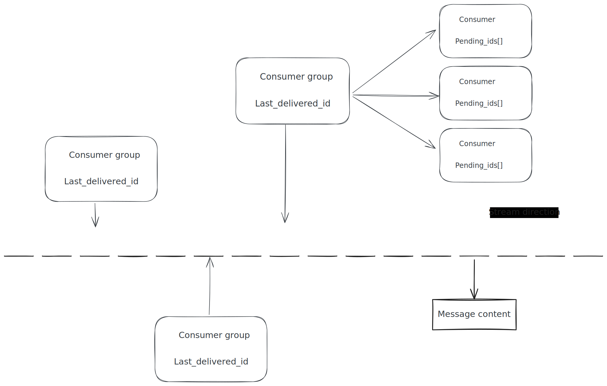

# [0021. Redis Stream](https://github.com/Tdahuyou/TNotes.redis/tree/main/notes/0021.%20Redis%20Stream)

<!-- region:toc -->

- [1. 📝 概述](#1--概述)
- [2. 📒 Redis Stream](#2--redis-stream)
- [3. 📒 消息队列相关命令](#3--消息队列相关命令)
- [4. 📒 消费者组相关命令](#4--消费者组相关命令)

<!-- endregion:toc -->

## 1. 📝 概述

- 了解 Redis Stream 数据结构 —— 消息链表。
- 了解消息队列（MQ，Message Queue）的两种实现方式（“Redis Stream”、“发布订阅”）之间的区别。

## 2. 📒 Redis Stream

- Redis Stream
  - Redis Stream 是 Redis 5.0 版本新增加的数据结构。
  - Redis Stream 主要用于消息队列（MQ，Message Queue）。
- 消息队列（MQ，Message Queue）
  - Redis 本身是有一个 Redis 发布订阅 (pub/sub) 来实现消息队列的功能，但它有个缺点就是 **消息无法持久化**，如果出现网络断开、Redis 宕机等，消息就会被丢弃。简单来说就是 **发布订阅 (pub/sub) 可以分发消息，但无法记录历史消息**。
  - Redis Stream 提供了消息的持久化和主备复制功能，可以让任何客户端访问任何时刻的数据，并且能记住每一个客户端的访问位置，还能保证消息不丢失。
- 消息链表
  - Redis Stream 是一个持久化的消息队列实现，其底层结构为 **消息链表**。
  - 每个 Stream 都有唯一的名称，它就是 Redis 的 key，在我们首次使用 xadd 指令追加消息时自动创建。
  - 每个消息具有唯一的 ID（`messageID`），并且按照插入顺序串接起来。
  - 消息一旦被添加到 Stream 中，就会按顺序持久化在 Redis 中，支持主从复制，确保数据不会丢失。
  - 消费者组（`Consumer Group`）和相关机制（如 `XREADGROUP`、`XACK` 等命令）进一步增强了 Stream 在消息处理中的可靠性与并发控制能力。
  - 
  - **Consumer Group**
    - 表示消费组
    - 使用 `XGROUP CREATE` 命令创建
    - 一个消费组有多个消费者 `Consumer`
  - **last_delivered_id**
    - 表示游标
    - 每个消费组会有个游标 `last_delivered_id`
    - 任意一个消费者读取了消息都会使游标 `last_delivered_id` 往前移动
  - **pending_ids**
    - 表示消费者 `Consumer` 的状态变量，作用是维护消费者的未确认的 id。
    - `pending_ids` 记录了当前已经被客户端读取的消息，但是还没有 ack（Acknowledge character：确认字符）。

## 3. 📒 消息队列相关命令

- `XADD` 添加消息到末尾
- `XTRIM` 对流进行修剪，限制长度
- `XDEL` 删除消息
- `XLEN` 获取流包含的元素数量，即消息长度
- `XRANGE` 获取消息列表，会自动过滤已经删除的消息
- `XREVRANGE` 反向获取消息列表，ID 从大到小
- `XREAD` 以阻塞或非阻塞方式获取消息列表

## 4. 📒 消费者组相关命令

- `XGROUP CREATE` 创建消费者组
- `XREADGROUP GROUP` 读取消费者组中的消息
- `XACK` 将消息标记为"已处理"
- `XGROUP SETID` 为消费者组设置新的最后递送消息 ID
- `XGROUP DELCONSUMER` 删除消费者
- `XGROUP DESTROY` 删除消费者组
- `XPENDING` 显示待处理消息的相关信息
- `XCLAIM` 转移消息的归属权
- `XINFO` 查看流和消费者组的相关信息
- `XINFO GROUPS` 打印消费者组的信息
- `XINFO STREAM` 打印流信息
